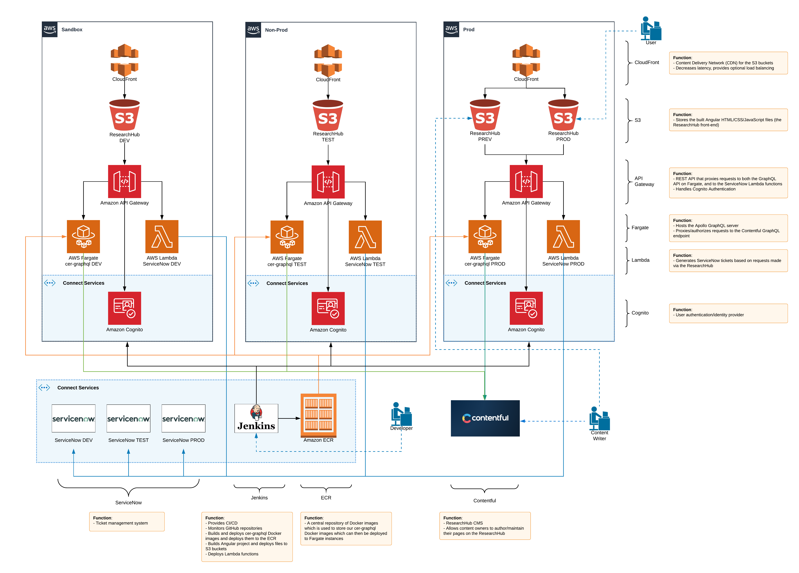

# ResearchHub Stack (monorepo)
Contains the complete [Research Hub](https://research-hub.auckland.ac.nz/), stack being developed for migration to [AWS](http://aws.auckland.ac.nz/) and [Contentful](https://contentful.com/).

## Stack Components
This repository contains the 3 projects comprising the AWS version of the ResearchHub stack.

###  1. [research-hub-web/](research-hub-web/)
The front end for the [Research Hub](https://research-hub.auckland.ac.nz/), built with [Angular](https://angular.io/) and [Angular Material](https://material.angular.io/).

### 2. [cer-graphql/](cer-graphql/)
An [Apollo GraphQL server](https://www.apollographql.com/docs/apollo-server/) used to proxy and authorise requests sent from `research-hub-web` to Contentful the external data sources.

### 3. [serverless-now/](serverless-now/)
A [Serverless Framework](https://www.serverless.com/) ([AWS Lambda](https://aws.amazon.com/lambda/)) function that generates tickets on the [UoA ServiceNow](http://uoaprod.service-now.com/) via `research-hub-web`.

## Deployment
CI/CD is achieved via the monorepo's [Jenkinsfile](Jenkinsfile) which is triggered when code is pushed to one of 3 Git branches corresponding the 3 [UoA AWS environments](http://aws.auckland.ac.nz/) (`sandbox`, `nonprod`, `prod`). 

## Architecture Overview

