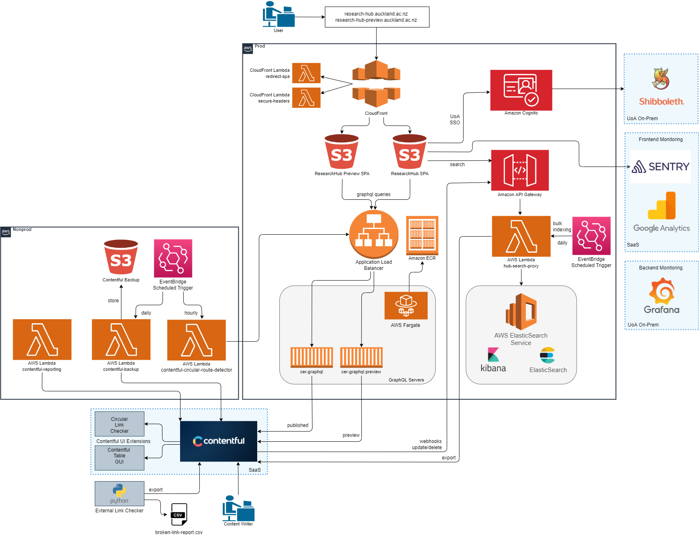

# ResearchHub Stack (monorepo)
Contains the complete [Research Hub](https://research-hub.auckland.ac.nz/), stack being developed for migration to [AWS](http://aws.auckland.ac.nz/) and [Contentful](https://contentful.com/).

## Stack Components
This repository contains the 4 projects comprising the AWS version of the ResearchHub stack.

###  1. [research-hub-web/](research-hub-web/)
The front end for the [Research Hub](https://research-hub.auckland.ac.nz/), built with [Angular](https://angular.io/) and [Angular Material](https://material.angular.io/).

### 2. [cer-graphql/](cer-graphql/)
An [Apollo GraphQL server](https://www.apollographql.com/docs/apollo-server/) used to proxy and authorise requests sent from `research-hub-web` to Contentful the external data sources.

### 3. [hub-search-proxy/](hub-search-proxy/)
A [Serverless Framework](https://www.serverless.com/) ([AWS Lambda](https://aws.amazon.com/lambda/)) function that interacts with ResearchHub's ElasticSearch instance.

### 4. [terraform/](terraform/)
Terraform infrastructure as code to create the Research Hub AWS infrastructure.

### 5. [subhub-link-checker/](subhub-link-checker/)
A [Contentful App Framework app](https://www.contentful.com/developers/docs/extensibility/app-framework/) that checks to prevent cyclical content references in SubHubs.
## Deployment
CI/CD is achieved via the monorepo's [Jenkinsfile](Jenkinsfile) which is triggered when code is pushed to one of 4 Git branches (`sandbox`, `dev`, `test`, `prod`) corresponding to environments across the three [UoA AWS accounts](http://aws.auckland.ac.nz/) (`sandbox`, `nonprod`, `prod`). 

Pushing to any branch prefixed with `sandbox-`, e.g. `sandbox-sam` will also trigger a deploy to `sandbox`.
Pushing to any branch prefixed with `dev-`, e.g. `dev-sam` will also trigger a deploy to `dev`.
However, test and prod deploys will ONLY be triggered by a push to the test or prod branch respectively.

NOTE: The sandbox account is only for temporary usage. All resources created in sandbox should be destroyed when no longer needed.

## Architecture Overview

## Development and Release Process

## UoA Wiki
[ResearchHub Wiki Page](https://wiki.auckland.ac.nz/pages/viewpage.action?spaceKey=APPLCTN&title=ResearchHub)
