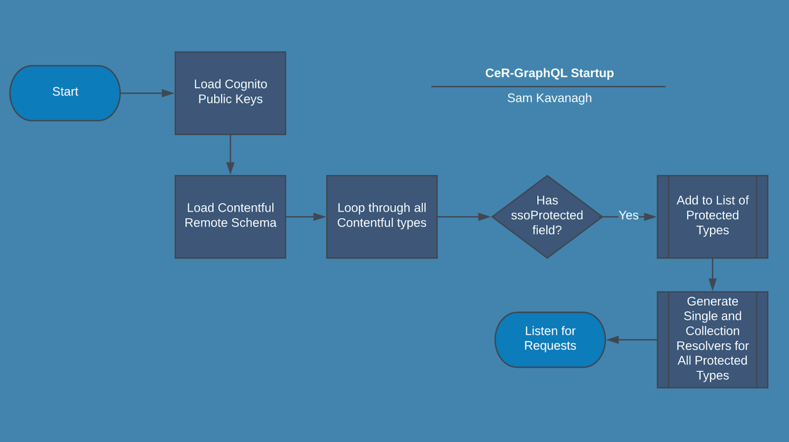
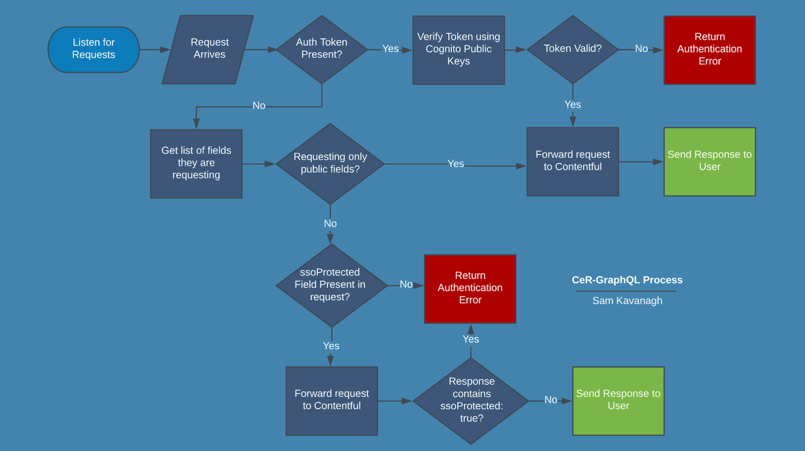

# CeR GraphQL

## Overview
An [Apollo GraphQL server](http://apollographql.com/docs/apollo-server/) used to proxy and authorise requests to [Contentful](https://contentful.com). Deployed on AWS via [Jenkins Pipeline](../Jenkinsfile).

1. Loads a remote GraphQL schema from Contentful
2. Replaces the resolvers for any GraphQL `types` with an `ssoProtected` field with custom authorisation logic
3. Proxies all requests sent between the [ResearchHub Web](../research-hub-web/README.md) and Contentful

Graphical representations of these processes are provided below.

### Languages/Frameworks
* [Apollo GraphQL server](http://apollographql.com/docs/apollo-server/)
* [Node.js](https://nodejs.org/en/)

### Other Technologies:
* [Docker](https://www.docker.com/): The project is containerised by the [Jenkins Pipeline](../Jenkinsfile), before being deployed to `ECR`
* [AWS ECS/ECR](https://aws.amazon.com/ecr/):  Amazon Elastic Container Registry, used to store the built docker images which are then deployed to `Fargate`
* [AWS Fargate](https://aws.amazon.com/fargate/): Serverless Compute used to execute the Docker containers
## Local Development
To develop this project locally, you must ensure that that you have populated the variables present in the monorepo [../.env](../.env) file. An example `.env` file has been provided at [../.env.example](../.env.example). Then simply execute `npm run dev` in this directory. This will create a locally running instance of the server, served on port `4000`. Modifying any files within the `cer-graphql/` directory will reload the server. Add the `IS_PREVIEW_ENV=true` variable in the `.env` file to run the preview version of cer-graphql.

## Preview environment
Aside from the main site, a preview version of the site is also built for content authors to view draft articles before they're published. The preview version of the cer-graphql uses a content preview access token instead of the regular content delivery API token while sending queries, and [adds a `preview` argument](https://www.contentful.com/developers/docs/references/graphql/#/introduction/previewing-content) to all GraphQL requests to the Contentful GraphQL content API. This will make Contentful to send unpublished content in results. Otherwise it is identical in functionality to the production version of cer-graphql.

You can activate the preview version by building cer-graphql as usual, then ensure the environment variable `IS_PREVIEW_ENV=true` is set, and `CONTENTFUL_ACCESS_TOKEN` is set with a content preview access token, generated in Contentful's Keys page. These variables can either by set through the command line, or in the monorepo [../.env](../.env) file.

See also the README.md files in `research-hub-web` and `terraform` folders, and also the monorepo README.md.

## Testing
This project includes `integration tests` written for the [Jest](https://jestjs.io/) testing framework. These tests are contained in the file [integration-tests.test.js](./tests/integration-tests.test.js). These tests can make use of predefined `GraphQL queries` which are stored in the file [test-queries.js](./tests/test-queries.js).

### Executing Tests
To execute the integration tests execute `npm run test`.

## Startup Process

## Authentication Process
